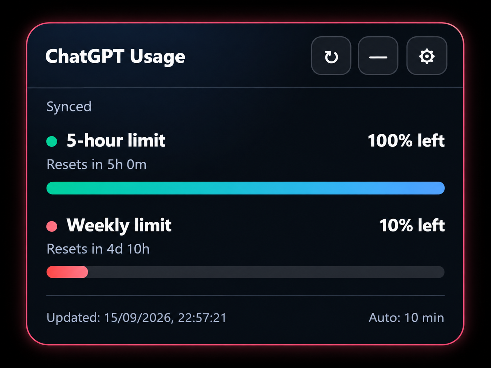
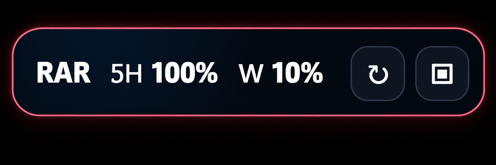

# RAR ChatGPT Usage Monitor

A lightweight Chrome/Chromium extension that keeps your ChatGPT **5-hour** and **weekly** usage limits visible while you chat.

## Screenshots

### Full widget

### Mini mode

## v1.2.0 highlights

- Native **Settings → Usage → Plan limits** sync.
- 5-hour and weekly remaining percentage + reset countdown.
- Full glass widget and compact mini pill mode.
- Warning under 35%; critical under 20%.
- On-screen alerts and optional sound alert.
- Draggable position memory.
- 5 / 10 / 15 / 30 minute refresh choices.
- Optional public GitHub version check — no automatic install and no background service worker.
- Sound is gated behind a browser user gesture to avoid AudioContext errors.
- Fully scoped CSS; it does not style ChatGPT outside the widget.
- Migrates compatible v1.1 local settings/data when possible.

## Installation

1. Download `RAR_ChatGPT_Usage_Monitor_v1.2.0.zip`.
2. Extract it.
3. Open `chrome://extensions/`.
4. Enable **Developer mode**.
5. Click **Load unpacked** and select the extracted folder.
6. Refresh ChatGPT.

Full guide: [docs/INSTALLATION.md](docs/INSTALLATION.md)

## Controls

- `↻` sync now
- `—` compact to mini mode
- `▣` expand from mini mode
- `⚙` alerts, refresh interval and version-check settings
- Drag the widget header to move it

## Update checker

v1.2.0 can optionally check the repository's public `version.json`. If a newer version exists, the widget shows an update badge and a link to the GitHub Releases page. It **does not auto-install** anything.

## Privacy

No password, OpenAI API key, session token, conversation text, or usage value is sent to the project author. See [docs/PRIVACY.md](docs/PRIVACY.md).

## Troubleshooting

See [docs/TROUBLESHOOTING.md](docs/TROUBLESHOOTING.md).

## Release notes

See [RELEASE_v1.2.0.md](RELEASE_v1.2.0.md) and [CHANGELOG.md](CHANGELOG.md).

## License

MIT License.
